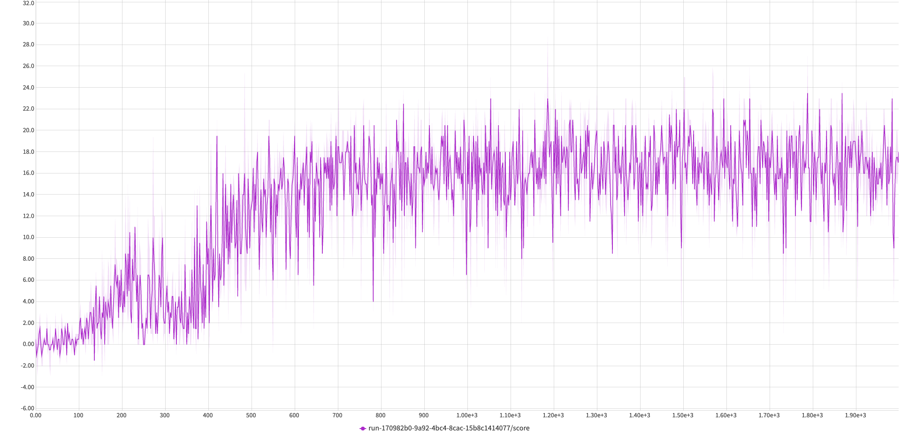

# rl-banana-collector
This repository is a solution to problem posed in RL nanodegree - collecting bananas in a 3D Unity environment.
The details of the problem are in the [nanodegree repository](https://github.com/udacity/deep-reinforcement-learning)
in the [p1 navigation folder](https://github.com/udacity/deep-reinforcement-learning/tree/master/p1_navigation)

## Problem description
The game lets agent collect yellow and blue banans in a square environment, which resembles the gif below     

### Action range
The agent has the following action range:  
* `0` - move forward
* `1` - move backward
* `2` - turn left
* `3` - turn right

### Rewards
The agent gets the following rewards:
* `+1` for collecing a yellow banana
* `-1` for collecing a blue banana

### State Space
The agent doesn't observe the environment directly (that is, by using observing the raw pixel data).
Instead, every state (so, every position in the environment) provides data about the agents velocity plus 
rays sent by the agent and collisions with these rays. For example, the agent collects the information if a ray 20
degreees from his front collides with a banana, or a wall and what the distance is. The detailed description of 
the state space is provided in [this](https://github.com/Unity-Technologies/ml-agents/issues/1134#issuecomment-417497502)
comment.

### Objective
The overall goal of the project is to achieve an *average score of 13 bananas over 100 episodes*. In case of this 
repository, the final result is ca. 16. 

## Learning Process 
The learning process was monitored using the neptune.ai service, with details regarding the final experiment provided 
under [this link](https://app.neptune.ai/wsz/RL-bananas/e/RLBAN-51/charts). 

The plot showing average rewards from the learning process can be seen below. The whole process was ran for 2000
epochs, although the average of 13 was reached after ca. 570 epochs.

The method used to train the agent is a Deep-Q Network. Additional solutions used to facilitate the learning process were:
* Replay memory
* Dueling DQN - described in [this paper](https://arxiv.org/abs/1511.06581)

The main inspiration behind the provided solution is the original [paper](https://storage.googleapis.com/deepmind-media/dqn/DQNNaturePaper.pdf)
introducing the Deep-Q learning architecture.

The final architecture of a neural network is slightly changed, due to different input types (raw pixels in the paper
and a simpler ray+velocity data in this problem) and the use of a duelling network. 

The agent is allowed to explore the environment at the start and then gradually move towards picking the greedy action.
The *epsilon* provided for the epsilon-greedy strategy for picking actions decreases linearily in the first epochs
and then continues on the base level until the rest of the training. The exact values can be found in `src.config.py` file.

### Running the example
To run the example, it is necessary to have a banana unity environment in a path determined in the `src.config.py` file.

After this is done, simply run a trained agent with:

`python main.py eval`

or train a new agent with

`python main.py train`