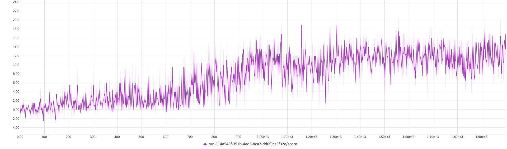

# Report

## Introduction
This report describes the implementation used to solve the reinforcement learning task. The exact details of the problem
are provided in the `README.md` file.

## Neural network architecture
To solve the problem, a duelling DQN was used. In my experiments I found that after some exploratory steps, the model
reaches higher reward values and reaches them faster. The model consists of:
* state layers
* advantage layers

These layers are meant to establish the value of a given state and of all actions separately and then combine them into a final result.
For each of the layer block, a simillar structure was used:
* Linear layer (state size=37 -> 128 neurons)
* Linear layer (128 neurons -> 64 neurons)
* Linear layer (64 neurons -> output neurons)

The output neurons value was 1 and *action size=4* in state and advantage blocks respectively.

Regarding the numbers of the neurons - it was found that a smaller network (with 64 neurons instead of in first and second layer)
also does work for the problem. However, the average of 13 wasn't always reached and the training took much more episodes
(ca. 1800 to reach the final values). The exact plot for that learning process is shown below - the final average over 100 episodes
was 12.51, so not quite filling the objective. The exact details and interactive plot can be found 
[here](https://app.neptune.ai/wsz/RL-bananas/e/RLBAN-50/charts)

The final plot for the larger network shows a steep learning process between 300 and 500 epochs and then a plateau. 
Therefore, larger number of parameters is needed for the model to achieve the given objective value

## Memory

Experience replay (without prioritization) was used to solve the problem. The buffer size used was 1e6 - the intuition was
that as the state space is large, a large buffer is required to collect more experiences which are valuable for the agent.

## Hyperparameters

The hyperparameters are stored in the `src.config.py` file. The final values were:
* Learning rate = `1e-4`
* Gamma = `0.99`
* Tau = `1e-3`
* Starting value of epsilon = `1`
* Final value of epsilon = `0.01`
* Number of epochs = `2000`
* Exploratory epochs = `250`
* Momentum = `0.95`
* Batch size = `64`
* Update interval = `4`

In this work, the approach from the original DQN was adopted, where the epsilon value decreases linearly at the start
of the experiment and then stays at the bse level until the end of the experiment. As the number of epochs in the DNQ
paper was largely different, the final values used were 250 for exploration and 2000 for final episode count.

## Ideas for future developments
The project can be further developed by:
* implementing learning on the raw pixel data
* implementing prioritized experience replay
* experiment further with the model parameters to find the optimal values, providing faster learning and possibly, better final score
* examine if a larger network can outperform the final one - perhaps test the limit of the task and maximum achievable limit
and then shrink the network to achieve the optimal result in terms of score and network size
* check how the algorithm performs in different environments (this would not boost the model literally, but would
provide intuition regarding parameters and required model complexity)
* after the final agent was ran a couple of times, it was noticed that the agent has a specific problem - if a good banana is approached
in a path which is perpendicular to a wall, the agent sometimes gets stuck with its "vision" blocked by the wall. Perhaps more training
addressing this specific issue would be required - like giving an additional, small reward for having unblocked vision or 
subtracting reward for seconds spent in the blocked vision state